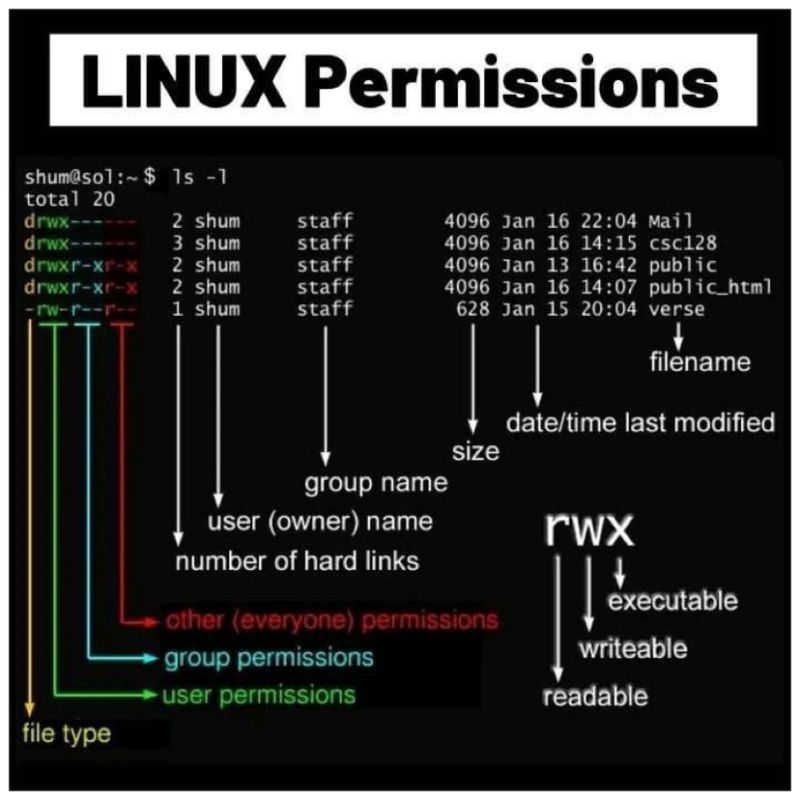
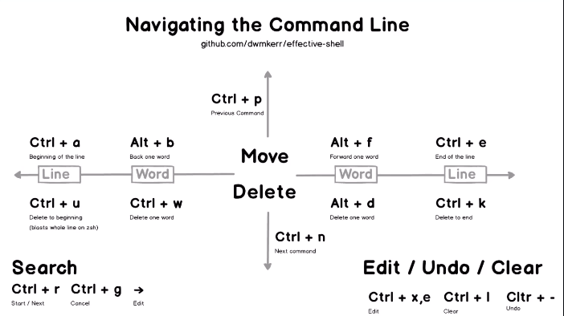
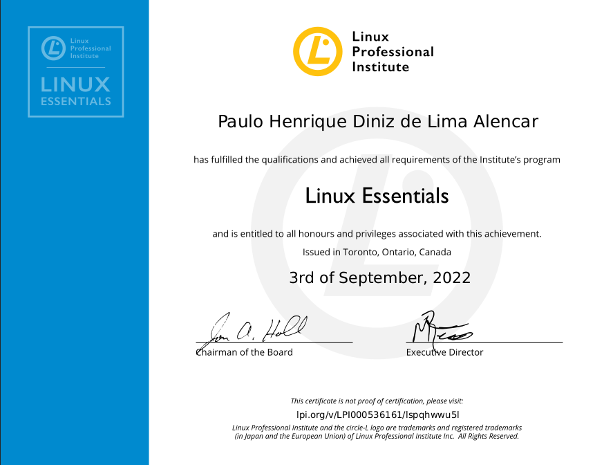

# Resumo: Certificação Linux Essentials

Fiz esse resumo 2 dias antes de fazer minha prova para a certificação Linux Essentials. Eu espero que o resumo ajude. Voltado pra quem gosta de conteúdo com leitura.

## O que é a Certificação Linux Essentials?

_"The Linux Essentials certificate is a great way to show employers that you have the foundational skills required for your next job or promotion. It also serves as an ideal stepping stone to the more advanced LPIC Professional Certification track for Linux Systems Administrators."_

- 1.Página principal da certificação: [link](https://www.lpi.org/our-certifications/linux-essentials-overview)
- 2.Tópicos que caem na prova da certificação: [link](https://www.lpi.org/our-certifications/exam-010-objectives)

## Resumo:

01. Linux = Kernel
02. Open Source Initiative (OSI)
03. Free Software Foundation (FSF)
04. Open Source -> código de fonte aberto
05. Free software -> livre para o usuário (free != libre, free beer != free software)
06. FOSS -> Free and Open Source Software = Sofware livre e de código aberto
07. FLOSS -> free/libre Open Source Software = Libre += FOSS
08. Copyleft vs. Permissive (Respectivamente, mantém mesma lincença após modificação; pode mudar a licença)
09. Licenses: GPL -> GNU General Public License 
10. [GPLv1, GPLv2, GPLv3, LGPL], v1 = versão 1 ...
11. Software [Commercial=Pago, Shaware=junção do commercial+freeware, Freeware=gratuito/presente]
12. Distribuição: diferentes sabores do Linux (Distribuição = Kernel + GNU core Utils, Softwares Suple. + Scripts/Serviços + Instaladores)
13. [Debian] -> Ubuntu -> Mint (foco em máquinas locais); [Red Hat] -> CentOS -> Scientific (foco em servidores e enterprise); [Slackware] -> SUSE -> OpenSUSE 
14. Enterprise $$ | R$ -> Red Hat Enterprise Linux, SUSE
15. LTS -> Long-Term Suport (versões mais estáveis)
16. Embarcados (Celulares - Android (Distribuição linux usadas nos Smatphones))
17. Android - Distribuição Linux para mobile
20. ioT - Internet of things; ex: Raspberry (plaquinha integrada/mine computador)
21. Cloud - (iaaS - Infrastructure as a Service) --> Linux é muito utilizado
22. FHS - File System Hierarchy

   _"Tudo no linux é arquivo"_
    
    / --> root (raiz)
    
    | _ _ _ /bin   -> arquivos/comandos binários (contém programas essenciais e acessíveis a qualquer usuários [/bin/ls, /bin/cat, /bin/mkdir, /bin/cp])
    |
    | _ _ _ /boot  -> arquivos estáticos de boot, carregadores de boot de segundo estágio, e o gerenciador de boot (permite escolher e carregar o S.O)
    |
    | _ _ _ /dev   -> arquivos de dispositivos (devices [mouse, hd, placa de som, placa de vídeo, ...]) Ex: verifique seu mause com: cat /dev/inout/mice ou od /dev/input/mice ou hexdump /dev/input/mice
    |
    | _ _ _ /etc   -> environment tasks and control - contém arquivos de configurações da máquina. Ex: configurações padrão paara login de usuários, presente em /etc/passwd
    |
    | _ _ _ /home  -> diretórios dos usuários comuns do sistema
    |
    | _ _ _ /media -> ponto de montagem temporários para mídias removíveis (pen-drive, hd, cd, cameras)
    |
    | _ _ _ /mnt   -> ponto de montagem temporários para sistemas de arquivos montados
    |
    | _ _ _ /opt   -> softwares adicionais (adicionados pelo usuários, geralmente programas proprietários e que não fazem parte oficialmente da distro)
    |
    | _ _ _ /sbin  -> binários do sistema essencias administrativos (contém arquivos binários essenciais p/ carregar e administrar o sistema [ifconfig, useradd, cron, ip, route, init])
    |
    | _ _ _ /srv   -> dados de serviços providos pelo sistema
    |
    | _ _ _ /tmp   -> arquivos temporários (área volátil limpada durante a inicialização)
    |
    | _ _ _ /var   -> arquivos variáveis que possuem um conteúdo dinâmico (arquivos de log, cache, banco de dados e arquivos de sites...)
    |
    | _ _ _ /root  -> home do superusuário (root)
    |
    | _ _ _ /proc  -> armazena informações dinâmicas do S.O, como processos, informações sobre entrada e saída, modelo de processador, versão do kernel (este diretório não existe no HD e sim na RAM)
    |
    | _ _ _ /usr   -> hierarquia secundária.  Maior diretório do sistema após o diretórios raiz. Todos os subdiretórios dentro de /usr não são essenciaise tem estrutura semelhante com o / do sistema
    |
    | _ _ _ /usr/bin  -> binários não essencias
      _ _ _ /usr/sbin -> binários administrativos não essencias
      _ _ _ /usr/lib  -> bibliotecas não essenciais
      _ _ _ /usr/share/man -> documentações (manuais)
      _ _ _ /usr/src -> códigos-fonte (kernel)
    |
    |
    | _ _ _ /lost+found -> armazena arquivos recuperados pelo sistema
    |
    | _ _ _ /run   -> infomações sobre o sistema em execução desde o último boot; usuários logados; processos servidores em execução.
    |
    | _ _ _ /lib   -> bibliotecas essencias do sistema e módulos do kernel

23. Interfaces gráficas: GUI 
 - 1.KDE   - Inteface bonita, focada no usuário (tenta focar no usuário e desempenho)  
 - 2.LXDE  - Leve; focada em desempenho, não em agradar usuário. 
 - 3.UNIT  - Interface bonita, focada no usuário (descontinuada; utilizada no ubuntu).
 - 4.XFCE  - Interface relativamente bonita; Leve; focada em desempenho, não em agradar o usuário.
 - 5.GNOME - Interface bonita, focada no usuário (utilizada no ubuntu).

24. Aplicações Open Source
- 1.Open-Office - Suite de texto
 - 2.Thunderbird - Cliente de e-mail
 - 3.Firefox
 - 4.Libre-Office - Suite de texto:
    - Calc --> planilhas
    - Draw --> desenhos vetorizados
    - Impress --> apresentação
    - Math ---> fórmulas matemáticas
    - Writer --> Editor de texto 
    
 - 5.Gimp - edição de imagens
 - 6.Blender - design 3D e animações
 - 7.Multimídea: Amarok, Audacious, Banshee
 - 8.links - browser no terminal

25. Aplicações para Servidores Open-Source
 - 1.Apache - 80 | Nginx - 443
 - 2.MariaDB | Mysql - 3306
 - 3.NSF - 2049
 - 4.Sampa - 139/445
 - 5.SSH - 22
 - 6.DNS - 53
 - 7.Telnet - 23
 - 8.SMTP - 25
 - 9.CUPS - 634
 - 10.OWNCLOUD
 - 11.NextCloud

26. Método de desenvolvimento:
 - 1.Cathedral - código fonte está disponível para cada release do software, mas o código desenvolvido entre dois releases é restrito a um grupo de dev.
 - 2.Bazaar    - código é desenvolvido de forma totalmente aberta e pública, utilizando a internet (Linus Torvalds é o inventor desse modelo de desenvolvimento)     

27. Linguagens Compiladas e Interpretadas
- 1.Linguagens Compiladas - c, go, haskel 
- 2.Linguagens Interpretadas - python, php, shell-script

28. Gerenciamento de pacotes .deb:
 - 1.Distros baseadas no debian:
  - apt (alto nível)   -> instala os pacotes por meio de repositórios oficiais (instala dependências)
  - dpkg (baixo nível) -> tenho que baixar o pacote .deb localmente e realizo a instalação (não instala as dependências e a instação é local)

- APT - Instalação:

1. Instalação:
```sh
apt install <nome-do-pacote> 
```
- APT - Remoção:
1. Remoção:
```sh
apt remove <nome-do-pacote> 
```
Obs: Remove somente o programa
2. Remoção:
```sh
apt remove --purge <nome-do-pacote> 
```
Obs: 
- remove 
-- 1.remove o programa em si.
- \- -purge
-- 2. remove os arquivos de configurações.
3. Remoção:
```sh
apt autoremove
```
Obs: remoção das bibliotecas que não estão sendo usadas
- APT - Atualizações:
1. update (atualiza os repositórios da minha máquina, com base no /etc/apt/source.list)
```sh
apt update 
```
2. upgrade (faz upgrade dos pacotes do sistema)
```sh
apt upgrade 
```
3. dist-upgrade (atualiza o kernel)
```sh
apt dist-upgrade 
```
- APT - buscas:
1. Eu conheço 3 formas:
```sh
apt-cache search <nome>
```
```sh
apt search <nome>
```
```sh
aptitude search <nome>
```
- APT - Informações sobre determinado programa:
```sh
apt show <nome>
```
```sh
aptitude show <nome>
```
Obs: em relação a esse último, ele faz uma listagem com alguma características, como: i - está instalado, p - não estã instalado.

- DPKG - Instalação:
```sh
dpkg -i <nome-do-pacote>
```
Obs: Se não necessitar de dependências, vai instalar tranquilamente. Caso contrário rode o seguinte comando:
```sh
apt --fix-broken install
```
OU
```sh
apt -f install 
```
OU
Instale cada dependência manualmente (vai dar trabalho, Bino), com o 
```sh
dpkg -i <nome-do-pacote>
```
- DPKG - listagem de pacotes instalados:
```sh
dpkg -l
```
Obs: seria legal fazer uso do comando 'grep' para melhorar sua busca. 
- DPKG - remoção:
1. Removendo apenas o programa
```sh
dpkg --remove <nome-do-pacote>
```
2. Removendo os arquivos de configurações:
```sh
dpkg --purge <nome-do-pacote>
```
3. Removendo as dependências não utilizadas:
```sh
apt autoremove
```
29. Gerenciamento de pacotes .rpm
 1.Distros baseadas no Red Hat
  - yum -> instalar pacotes que vem dos repositórios oficiais da distro (instala as dependências)
  - rpm -> instalação de pacotes locais (não instala as dependências)

- YUM - Instalação:
```sh
yum install <pacote(s)>
```
- YUM - Atualização (atualiza o cache e o sistema):
```sh
yum update
```
- YUM - Remoção:
```sh
yum remove <pacote(s)>
```
- YUM - Busca:
```sh
yum search <pacote(s)>
```
- YUM - Listagem:
```sh
yum list installed
```
- YUM - Verificar se existe atualização para determinado programa:
```sh
yum check-update <nome-do-pacote>
```
- YUM - Listar dependências
```sh
yum deptlist <nome-do-pacote>
```
- YUM - Remoção de dependências/bibliotecas que não estão sendo utilizadas
```sh
yum clean packages
```
OU
```sh
yum clean all
```
- RPM - Instalação:
```sh
rpm -ihv <nome-do-pacote>
```
Obs: (i-instalação, h-porcentagem, v-verbose)
- RPM - Remoção:
```sh
rpm -e <nome-do-programa>
```
Obs: (e-eraser, só remove o programa)
- RPM - Busca:
```sh
rpm -qa
```
Obs: (q-query, a-all, faz uma busca de todo os pacotes)
- RPM - Busca específica:
```sh
rpm -qa | grep -i <palavra-buscada>
```
OU
```sh
rpm -q <palavra-chave>
```
OU
```sh
rpm -qi <palavra-chave>
```
Obs: (i - mais informações) 
- RPM - Listagem (listar bibliotecas que o programa está utilizando):
```sh
rpm -qR <programa>
```

30. Terminal virtual - TTY (alternar entre tty --> ctrl + alt + f1,f2,f3,f4,f4,f6...)
31. Shell - interpreta nossos comandos
32. Shell padrão - Bash, i.e, usr/bin/bash, para mudar $ sudo usermod -s /usr/bin/zsh <user> (muda para zsh) 
33. Para mostrar shell padrão: $ echo $0 ou $ echo $SHELL
34. ls - use os ls --help e aprenda as opções
35. $PATH --> contém todos os diretórios que o bash vai pesquisar por determinado binário/script 
36. Diferentes forma de mostrar usuário: whoami; echo $USER; echo $LOGNAME; echo $USERNAME
37. Alterano usuário $ su <user>
38. Desligando: init 0; poweroff; shutdown; halt; shutdown-h; shutdown 17:00 (vai desligar 17:00 h)
39. Reiniciar: init 6; shutdown -r; shutdown -r 3 (vai reiniciar daqui 3 min)
40. Nível do usuário: $ runlevel (N 5 - multi-usuário com interface gráfica; N 3 - multiusuário sem interface gráfica)
41. Para informações básicas do sistema, utilize: uname; uname --help para conhecer as outras flags (uname -r, para a versão do kernel e uname -m, para arquitetura do sistema)
42. Onde estou: $ pwd ou echo $PWD
43. Um pouco sobre os diretórios:
```
.    --> diretório atual
. .  --> direório pai
~    --> diretório home
-    --> diretório anterior
```

44. Hitórico de comandos do bash: presente em .bash_history, comando history (mostra histórico do bash); olhando o manual do bash posso achar variáveis relacionadas ao file .bash_history
45. Variáveis LOCAIS: somente tal sessão do bash pode acessar; Variáveis GLOBAIS: sessões filhas de tal bash podem acessar
46. set --> para listar variáveis locais (disponíveis penas para aquela sessão do bash)
47. env --> para listar variáveis globais/environment
48. $ NOME='Paulo'  --> variável local
49. $ export NOME='Giovanna' --> variável global
50. File Globbing - diz respeito a dígitos especiais que podemos utilizar no bash, que utilizamos para encontrar arquivos que tenham determinado padrão
51. 
```
    \*  --> tudo
    ?   --> 1 dígito somente (pode ser qualquer dígito)
    []  --> lista de dígitos
    [^] --> nega os elementos da lista
```
52. Quoting - (") shell consegue interpretar dígitos especiais; (') shell trata tudo que está dentro da aspas simples como um dígito; (\) diz para o shell que ele deve interpretar próximo caractere como dígito normal
53. Dígito especial exemplo: $ cd diretorio\ paulo 
54. Nome do host: $ hostname ou $ hostnamectl 
55. Alterando o hostaname: $ sudo hostnamectl set-hostname <host-name>
55. \# --> superusuário
56. $ --> usuário comum
57. ls -l /home/paulo --> (ls é comando, -l é parâmetro e /home/paulo é o argumento)
58. localização de arquivos e diretórios: locate e find
59. Utilizando os manuais: $ man <comando>; Buscando manuais: $ apropos <palavra-chave> equivale $ man -k <palavra-chave>; $ whatis <comando> equivale $ man -f <comando>
60. Utilizando o info: info <comando> (vantagem possui: paginação e utuliza hiperlinks)
61. Documentações estão presente em: /usr/share/man ou /usr/share/doc
62. Caminhos absolutos: caminhos completos (sempre tem raiz). ex /usr/share/man ou /usr/share/doc 
62. Caminhos relativos: relativos ao diretório atual. ex Documents/ ou cd .config ou cd ~/.config
63. Posso criar árvores de diretórios: mkdir -p dir1/dir2/dir3  
64. Copiando recursivamento: cp -r dir1/dir2/* .
65. Preservando infomações, como permissões, inode, timestamp: cp -a /proc/cpuinfo .

## Imagens úteis




## PDF da minha certificação


## Links para estudar

1. Linux-Essentials [link](https://learning.lpi.org/pt/learning-materials/010-160/)
2. Curso gratuíto [link](https://lcnsqr.com/curso-linux-essentials)
3. Cursos gratúitos - Linux [link](https://4linux.com.br/cursos/cursos-gratuitos/)
4. Linux for Programmers [link](https://youtube.com/playlist?list=PLzMcBGfZo4-nUIIMsz040W_X-03QH5c5h)
5. Linux for Hackers [link](https://youtube.com/playlist?list=PLIhvC56v63IJIujb5cyE13oLuyORZpdkL)

## Licença

[Creative Commons license](https://creativecommons.org/)
